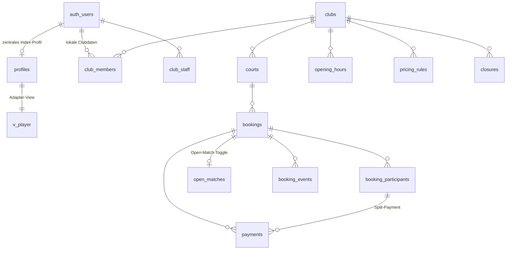

# Schritt 1 · Datenbank-Architektur

> Status: implementiert in `supabase/migrations/`, getestet gegen PostgreSQL 16
> (`./supabase/tests/run.sh`, 18 Assertions grün).

## Die vier Entscheidungen, die alles andere bestimmen

### 1. Eigenes Schema `booking` statt `public`

Playindex teilt sich das Supabase-Projekt mit dem Index-Ökosystem (siehe
[SSO-Dokument](./02-sso-cross-login.md)). `public` gehört PadelIndex/TennisIndex.
Alle Buchungsobjekte liegen deshalb in `booking`, die SSO-Bridge in `sso`.

Das kostet einen Konfigurationsschritt und kauft dafür: keine Namenskollisionen
(`bookings`, `courts`, `payments` sind generische Namen), getrennte Grants und
eine klare Eigentumsgrenze bei Reviews und Backups.

**Nötige Einstellung:** Supabase Dashboard → Settings → API → *Exposed schemas*
um `booking` ergänzen. Im Client dann:

```ts
createClient(url, key, { db: { schema: 'booking' } })
```

### 2. Doppelbuchungen sind physikalisch unmöglich, nicht "wegvalidiert"

```sql
constraint bookings_no_overlap exclude using gist (
  court_id   with =,
  time_range with &&
) where (status in ('pending','confirmed'))
```

Ein `EXCLUDE`-Constraint über `(Platz, Zeitraum)` ist der Unterschied zwischen
"wir prüfen vorher" und "kann nicht passieren". Er hält auch bei zwei
gleichzeitigen Requests auf denselben 19-Uhr-Slot, bei direktem SQL und beim
Eversports-Import. Zwei Spieler, die im selben Moment auf *Buchen* tippen –
genau das Szenario, in dem `select ... then insert` reißt.

Kollision meldet sich als `SQLSTATE 23P01` (`exclusion_violation`) und wird im
Frontend zu "Dieser Slot wurde gerade vergeben".

Konsequenz daraus: **Wartung, Kurse und Turniere sind Buchungen mit anderem
`type`**, keine eigene Tabelle. Damit gibt es genau eine Quelle für
Platzbelegung – und der Constraint schützt sie alle gleichermaßen.

### 3. Regeln liegen in der Datenbank, nicht im Frontend

Playindex bekommt mehrere Schreib-Clients: SvelteKit-Frontend, Club-Admin,
Eversports-Import, später PadelIndex-Sync und Zahlungs-Webhooks. "Nicht in der
Vergangenheit", "innerhalb der Öffnungszeiten", "Stornofrist 24 h", "Preis"
gehören deshalb an eine Stelle – Trigger auf `booking.bookings`.

Besonders wichtig: **der Client bestimmt nie den Preis.** `validate_booking()`
überschreibt `price_cents` serverseitig aus den Preisregeln. Der Test
"Preis manipulieren" ist genau dafür da.

### 4. Öffentliche Belegung ≠ öffentliche Buchungen

Das Grid muss ohne Login funktionieren (3-Klick-Ziel), darf aber nie verraten,
*wer* gebucht hat. Deshalb:

| Rolle | `booking.bookings` | `booking.v_court_availability` |
|---|---|---|
| `anon` | kein Zugriff | belegt von–bis, ohne Identität |
| `authenticated` | nur eigene / Teilnahmen | alles |
| Club-Personal | alles des eigenen Clubs | alles |

Die View läuft bewusst als `SECURITY DEFINER` (PostgreSQL-Default) und filtert
über die Spaltenauswahl statt über RLS.

> ⚠️ Deshalb **kein** `ALTER TABLE booking.bookings FORCE ROW LEVEL SECURITY` –
> das würde die Verfügbarkeits-View mit aushebeln.

---

## Datenmodell



| Tabelle | Zweck |
|---|---|
| `clubs` | Mandant + alle Buchungsregeln (Raster, Min/Max-Dauer, Vorlauf, Stornofrist) |
| `courts` | Plätze, Sportart, Halle/Außen, Belag |
| `opening_hours` | pro Wochentag, optional pro Platz, mit Saison-Gültigkeit |
| `closures` | Feiertage, Betriebsferien |
| `pricing_rules` | Tarife mit Priorität, Zeitfenster, Mitgliederpreis |
| `bookings` | **die** Belegungstabelle (Spieler, Kurse, Turniere, Wartung) |
| `booking_participants` | Mitspieler – Basis für Matchmaking *und* Split-Payments |
| `open_matches` | der "Als offenes Match einstellen"-Toggle |
| `payments` | vorbereitet, noch nicht aktiv |
| `booking_events` | Audit: angelegt, storniert, No-Show |
| `club_members` | **nur** club-lokale Daten |
| `club_staff` | Rollen `owner`/`admin`/`staff` |

---

## Zentrales Profil verknüpfen, ohne zu duplizieren

Das war deine explizite Frage. Die Antwort besteht aus drei Teilen.

**Es gibt genau eine Identität: `auth.users`.** Playindex legt keine eigene
Nutzertabelle an, kopiert keine E-Mail, keinen Namen, keine Elo.

**Was zentral ist, bleibt zentral.** Name, Avatar und Elo kommen aus
`public.profiles` (PadelIndex/TennisIndex). Playindex liest sie über eine
einzige Adapter-View:

```sql
booking.v_player  ->  user_id, display_name, avatar_url, padel_elo, tennis_elo
```

Diese View ist **die einzige Stelle im gesamten Schema**, die das zentrale
Profil-Schema kennt. Sie löst die Spaltennamen zur Migrationszeit dynamisch auf
(`display_name` / `username` / `full_name` …, `padel_elo` / `elo_padel` …), weil
ich die echten Namen aus deinem PadelIndex-Projekt nicht kenne. Passt keiner:
nur diese eine View anfassen, der Rest des Schemas bleibt unberührt.

Existiert `public.profiles` noch nicht (frisches Projekt, lokale Entwicklung),
legt die Migration ein Minimal-Profil an – im geteilten Projekt macht sie nichts.

**Was lokal ist, bleibt lokal.** `booking.club_members` enthält ausschließlich
Dinge, die nur das Sportcenter Hahn interessieren: Mitgliedsnummer, Tarif,
abweichende Rechnungsadresse, Guthaben, No-Show-Zähler, Sperrvermerk. Keine
Spalte doppelt sich mit dem zentralen Profil.

Interne Personalnotizen liegen in `club_member_notes` – eigene Tabelle, weil RLS
keine Spalten filtern kann und der Spieler die Notizen über sich nicht lesen soll.

---

## Split-Payments: heute vorbereitet, morgen ein Feature-Flag

Der entscheidende Kniff steckt in `booking_participants`: `share_cents`,
`paid_cents` und `payment_status` hängen bereits jetzt **am Teilnehmer**, nicht
an der Buchung. `payments.participant_id` ebenso.

Heute bekommt der Host beim Anlegen `share_cents = price_cents` – eine Zahlung.
Morgen teilt ein Job denselben Datensatz auf vier Spieler auf. Kein
Schema-Bruch, keine Migration bestehender Buchungen.

---

## Matchmaking-Connect

`open_matches` ist eine 1:0..1-Erweiterung der Buchung, keine Spalte in
`bookings`. Gründe:

- `bookings` bleibt schlank – das Grid trifft sie am häufigsten
- PadelIndex/TennisIndex synchronisieren genau eine Tabelle und brauchen keinen
  Zugriff auf Preise oder Buchungsdetails
- ein Match lässt sich schließen und wieder öffnen, ohne die Buchung anzufassen

Die Tabelle trägt `external_match_id`, `external_url`, `synced_at` und
`sync_error` für die Rücksynchronisation aus dem Index-System. `platform` wird
aus der Sportart des Platzes abgeleitet (Padel → padelindex, Tennis → tennisindex).

Storniert der Host die Buchung, setzt ein Trigger das Match automatisch auf
`cancelled`. Sind genug Spieler beigetreten, springt es auf `full`.

---

## API-Oberfläche für Schritt 3

```ts
// Ein Roundtrip = alles, was das Grid für einen Tag braucht
const { data } = await supabase.rpc('get_day_schedule', {
  p_club_slug: 'sportcenter-hahn',
  p_date: '2026-09-08',
  p_sport: 'padel'
})
// -> { club: { slot_minutes, min/max_duration, ... },
//      courts: [{ id, name, opens_at, closes_at, bookings: [...] }],
//      closures: [...] }

// Buchen inkl. Open-Match-Toggle, atomar
await supabase.rpc('create_booking', {
  p_court_id: courtId,
  p_starts_at: '2026-09-08T16:00:00Z',
  p_ends_at:   '2026-09-08T18:00:00Z',
  p_open_match: { enabled: true, players_needed: 2, level_min: 1300, level_max: 1600 }
})

// Preis vorab anzeigen (auch ohne Login)
await supabase.rpc('calculate_price', { p_court_id, p_starts_at, p_ends_at })

await supabase.rpc('cancel_booking', { p_booking_id, p_reason: 'Verhindert' })
```

`get_day_schedule` liefert bewusst auch die Club-Regeln mit – das Frontend
hardcodet weder Slot-Raster noch Öffnungszeiten noch Stornofristen.

---

## Was die Tests abdecken

`./supabase/tests/run.sh` (braucht nur ein lokales Postgres ≥ 14):

- Preis über eine Tarifgrenze hinweg: 16–18 Uhr Padel Di = 3200 + 4000 = **7200 ct**
- Mitgliederpreis derselben Buchung = **5400 ct**
- Doppelbuchung und Überlappung → `23P01`
- außerhalb Öffnungszeiten, neben dem Raster, zu lang, Vergangenheit, zu weit
  im Voraus → abgelehnt
- Preis manipulieren und Umbuchen → `42501`
- Bea sieht Alex' Buchung nicht, aber die Belegung und das offene Match
- `anon` liest `bookings` nicht, bekommt aber den kompletten Tagesplan
- Beitritt zum offenen Match klappt, Host-Rolle fälschen nicht
- SSO-Ticket: einlösbar, Replay abgewiesen, Ablauf abgewiesen, Rohtoken nirgends
  gespeichert
- Storno setzt das Open Match automatisch auf `cancelled`

---

## Offene Punkte für dich

1. **Seed-Daten sind Platzhalter.** `supabase/seed.sql` legt 4 Padel- und
   6 Tennisplätze, 07–23 Uhr und Beispielpreise an. Bitte durch die echten
   Werte des Sportcenters ersetzen.
2. **Spaltennamen in `public.profiles`** – schick mir das Schema aus dem
   PadelIndex-Projekt, dann fixiere ich `booking.v_player` fest statt dynamisch.
3. **Ein Projekt oder zwei?** Die Antwort steuert Schritt 2 – siehe
   [SSO-Dokument](./02-sso-cross-login.md).
