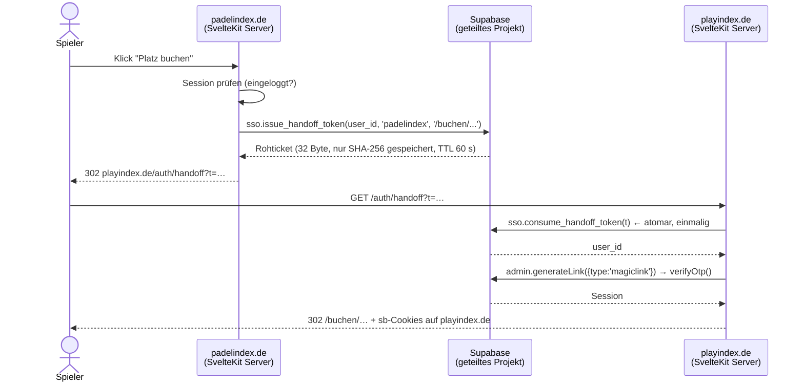

# Cross-Login zwischen playindex.de, padelindex.de und tennisindex.eu

## Das Problem sind zwei Probleme

Die Anforderung "Nutzer sollen sich mit denselben Credentials einloggen" enthält
zwei getrennte Fragen, die getrennte Lösungen brauchen:

| | Frage | Lösung |
|---|---|---|
| **1** | Funktioniert meine PadelIndex-E-Mail auf playindex.de? | Ein gemeinsames Auth-Projekt. Kein Code. |
| **2** | Muss ich mich beim Wechsel *nochmal* einloggen? | Handoff-Ticket. ~60 Zeilen Code. |

Der zweite Punkt ist der, an dem die meisten Architekturen scheitern – meist,
weil angenommen wird, ein geteiltes Supabase-Projekt teile auch die Session.
Das tut es nicht: `padelindex.de`, `tennisindex.eu` und `playindex.de` sind drei
verschiedene eTLD+1-Domains. Ein Cookie der einen Domain ist auf der anderen
grundsätzlich unlesbar – unabhängig davon, welches Backend dahinter steht.

Deshalb: Punkt 1 löst die *Anforderung*, Punkt 2 löst die *UX*.

---

## Entscheidung: ein gemeinsames Supabase-Auth-Projekt

Drei Wege standen zur Wahl.

### Option A — Ein Projekt für alles ✅ **Empfehlung**

Playindex nutzt dasselbe Supabase-Projekt wie das Index-Ökosystem: dieselbe
`auth.users`, dasselbe JWT-Signing, dieselben Profile.

**Dafür:**
- Null Nutzer-Duplikate, null Sync-Jobs, null "welche E-Mail hatte ich hier?"
- Elo und Buchung sind in *einer* Query joinbar – genau das ist dein USP.
  Ein offenes Match kennt die Elo des Hosts ohne API-Call.
- RLS prüft direkt gegen `auth.uid()`. Keine Föderationslogik, keine
  Token-Übersetzung, keine Key-Rotation-Baustelle.
- Ein Passwort-Reset wirkt überall.

**Dagegen (und wie abgefedert):**
- Gemeinsames Schicksal bei Downtime, Rate Limits, DB-Größe.
  → Playindex liegt in eigenem Schema `booking` mit eigenen Grants; ein Bug hier
  kann `public` nicht beschädigen.
- Buchungslast trifft dieselbe Instanz wie das Index-System.
  → Das Grid ist ein einziger RPC-Call (`get_day_schedule`) mit Indexen auf
  `(court_id, starts_at)`. Wird es eng, kommt Read-Replica/Connection-Pooling
  davor, bevor eine Projekttrennung nötig wird.

### Option B — Getrennte Projekte mit JWT-Föderation ❌

Das Playindex-Projekt vertraut den Tokens des Index-Projekts (gemeinsames
JWT-Secret bzw. fremdes JWKS).

Supabases *Third-Party Auth* ist auf externe Provider (Clerk, Auth0, Firebase,
Cognito) zugeschnitten – Supabase-zu-Supabase ist nicht der vorgesehene Pfad.
Ein geteiltes JWT-Secret koppelt beide Projekte an einen Wert, den man nicht
mehr rotieren kann, ohne beide gleichzeitig neu zu deployen. Und: `auth.uid()`
zeigt dann auf einen Nutzer, den die lokale `auth.users` gar nicht kennt –
jeder Foreign Key auf `auth.users(id)` fällt weg, inklusive der DSGVO-Kaskade.

### Option C — Eigener OIDC-Provider davor (Keycloak/Auth0/Clerk) ❌ *für jetzt*

Sauberste Lehrbuchlösung, aber: zusätzliches System, zusätzliche Kosten,
Migration aller drei Apps, und Supabase Auth wird zum reinen Token-Konsumenten.

Lohnt sich, sobald weitere Clubs oder Marken mit *eigenem* Login dazukommen.
Der Umstieg von Option A auf C ist später möglich, weil das Buchungsschema nur
über `auth.uid()` und `booking.v_player` an die Identität gekoppelt ist – zwei
Berührungspunkte, nicht zwanzig.

### Falls padelindex.de und tennisindex.eu heute zwei getrennte Projekte sind

Dann ist die Konsolidierung Voraussetzung, aber unkritisch: Supabase kann Nutzer
**mit ihrem bestehenden bcrypt-Hash** importieren
(`auth.admin.createUser({ email, password_hash })`). Niemand muss sich neu
registrieren, niemand braucht ein neues Passwort.

Reihenfolge: Projekt mit den *meisten* Nutzern wird zum Identity-Projekt →
Nutzer des zweiten importieren (E-Mail-Kollisionen zusammenführen) → Profile
migrieren → zweite App auf das Identity-Projekt umstellen → Playindex dazu.

---

## Der nahtlose Wechsel: Handoff-Ticket

Implementiert in `supabase/migrations/20260831120800_sso_handoff.sql`.

Der Nutzer sieht: Klick → Buchungsgrid. Kein Login-Formular, keine E-Mail.

### Warum eine eigene Ticket-Tabelle statt direkt `generateLink`?

Man *könnte* auf padelindex.de direkt einen Magic-Link erzeugen und dessen
`hashed_token` per Redirect übergeben. Dagegen spricht:

- Magic-Link-TTL ist eine **projektweite** Einstellung (Minuten bis Stunde) und
  gilt auch für echte Login-Mails. Unser Ticket lebt **60 Sekunden**.
- Der `hashed_token` ist ein vollwertiges Login-Credential in einer URL. Unser
  Ticket ist gegen genau einen Zweck gebunden und hart einmalig – das `UPDATE …
  RETURNING` *ist* die Einmal-Prüfung, zwei parallele Requests bekommen nur
  einmal eine Zeile.
- Wir haben einen Audit-Trail: `issued_by`, `audience`, `ip`, `user_agent`.

Der Magic-Link kommt trotzdem vor – aber erst auf der *Zielseite*, nachdem das
Ticket verifiziert wurde. Er verlässt nie den Server.

### Sicherheitsregeln, die im Code stehen müssen (Schritt 2)

| Risiko | Maßnahme |
|---|---|
| Ticket im Referrer/History | Sofort per 302 auf saubere URL, `Referrer-Policy: no-referrer` auf `/auth/handoff` |
| Open Redirect | `redirect_to` nur als **relativer Pfad**, gegen Allowlist geprüft |
| Replay | Datenbankseitig erzwungen (getestet) |
| Ticket-Diebstahl aus DB-Backup | Nur SHA-256-Hash gespeichert (getestet) |
| Brute Force auf `/api/handoff` | Rate-Limit pro Session, nicht pro IP |
| `service_role`-Key im Bundle | Ausschließlich `$env/static/private`, nie in `+page.svelte` oder `PUBLIC_*` |
| Cookies | `HttpOnly`, `Secure`, `SameSite=Lax` – Lax genügt, der Handoff ist ein Top-Level-GET |

Der Rückweg (playindex.de → padelindex.de, z. B. "Match auf PadelIndex ansehen")
nutzt denselben Mechanismus mit `issued_by='playindex'`.

### Was das Ticket **nicht** ist

Kein Passwort, kein JWT, kein Refresh-Token. Es ist ein 60 Sekunden gültiger
Einmal-Gutschein, der auf der Gegenseite gegen eine reguläre Supabase-Session
getauscht wird. Wird es abgefangen und ist bereits eingelöst, ist es wertlos.

---

## Was daraus für Schritt 2 folgt

- `playindex.de` bekommt eine normale Supabase-Auth-Route (E-Mail/Passwort +
  OAuth), die ohne Handoff funktioniert – der Handoff ist Beschleuniger, nicht
  Voraussetzung.
- `/auth/handoff/+server.ts` ist die einzige Route mit `service_role`.
- `hooks.server.ts` hält die Session über `@supabase/ssr` in `event.locals`.
- Auf padelindex.de/tennisindex.eu ist genau **ein** neuer Endpunkt nötig:
  `POST /api/handoff/playindex`.

Details folgen in Schritt 2.
