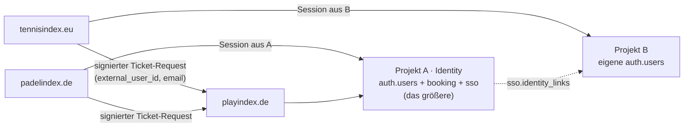

# Schritt 2 · SvelteKit-Struktur, Auth und Cross-Login

> Status: implementiert. `npm run check` → 0 Fehler, `npm run build` grün
> (adapter-cloudflare), `npm run test:sso` → 12/12.

## Route-Konzept

```
src/
├── hooks.server.ts                  Supabase-Client + Session pro Request
├── app.d.ts                         Locals-Typen (supabase, safeGetSession, user)
├── app.css                          Tailwind v4 + Design-Tokens
│
├── lib/
│   ├── types/database.ts            Typen für Schema `booking`
│   ├── utils/cn.ts                  clsx + tailwind-merge (shadcn-kompatibel)
│   └── server/                      ⛔ Import aus Client-Code bricht den Build
│       ├── supabase-admin.ts        service_role — nur hier
│       ├── sso-crypto.ts            reine HMAC-/Redirect-Logik (getestet)
│       ├── sso-crypto.test.ts
│       └── sso.ts                   Env-Anbindung dazu
│
└── routes/
    ├── +layout.server.ts            Session + Cookies nach unten
    ├── +layout.ts                   universeller Supabase-Client
    ├── +layout.svelte               Shell, onAuthStateChange → invalidate
    ├── +page.server.ts              → /buchen/<default-club>
    │
    ├── buchen/[club]/               ÖFFENTLICH, das Herzstück
    │   ├── +page.server.ts          ein RPC: get_day_schedule
    │   └── +page.svelte             ← Schritt 3 setzt hier BookingGrid ein
    │
    ├── (auth)/                      Login/Registrierung, eigenes Layout
    │   ├── login/
    │   └── registrieren/
    │
    ├── (konto)/                     GESCHÜTZT via +layout.server.ts
    │   └── meine-buchungen/
    │
    ├── auth/                        reine Endpunkte, keine Seiten
    │   ├── handoff/+server.ts       ← SSO-Einlösung
    │   ├── callback/+server.ts      OAuth/PKCE
    │   ├── confirm/+server.ts       E-Mail-Bestätigung
    │   └── logout/+server.ts        nur POST
    │
    └── api/sso/ticket/+server.ts    ← Partner holen hier ihr Ticket
```

### Warum diese Aufteilung

**`buchen/[club]` liegt in keiner Gruppe und braucht keinen Login.** Das ist die
wichtigste Struktur-Entscheidung: Das Grid ist die Startseite (`/` leitet direkt
dorthin), damit von den drei Klicks keiner für eine Landingpage draufgeht.
Login passiert erst beim Bestätigen der Buchung.

**`[club]` statt fester Route.** Das Schema ist mandantenfähig; die Route ist es
damit auch. Kostet heute nichts und erspart später eine Umstellung.

**Gruppen `(auth)` und `(konto)` statt Präfixe.** Die Klammern erscheinen nicht
in der URL — `/meine-buchungen` bleibt kurz, teilt sich aber Layout und Guard
mit allen anderen Kontoseiten.

**`auth/` ohne Klammern.** Diese Routen sind reine `+server.ts`-Endpunkte und
sollen bewusst *kein* Layout erben.

## Session-Handling

`hooks.server.ts` legt pro Request einen Supabase-Client an, der seine Session
in Cookies hält, und stellt `locals.safeGetSession()` bereit.

**Warum nicht einfach `getSession()`?** Weil das nur das Cookie liest und die
JWT-Signatur nicht prüft — ein manipuliertes Cookie käme durch. `safeGetSession`
verifiziert deshalb zusätzlich per `getUser()` gegen Supabase. Im ganzen Projekt
wird nirgends direkt `getSession()` für Autorisierung verwendet.

**Zwei Verteidigungslinien beim Guard.** Primär schützt
`(konto)/+layout.server.ts`. Zusätzlich prüft `hooks.server.ts` pfadbasiert —
denn **Layout-Loads laufen nicht für `+server.ts`-Endpunkte**. Das ist ein
verbreiteter Fehler: ein Endpunkt unter einer geschützten Gruppe ist ohne
eigene Prüfung offen.

**RLS ersetzt Filter im Code.** `meine-buchungen` fragt `bookings` ohne
`.eq('booked_by', …)` ab — die Policy liefert von sich aus nur eigene Zeilen.
Ein Filter, den man nicht schreibt, kann man auch nicht vergessen.

## Das `service_role`-Key

Genau ein Modul kennt es: `src/lib/server/supabase-admin.ts`. Alles unter
`src/lib/server/**` lässt SvelteKit beim Build hart scheitern, sobald es aus
Client-Code importiert wird. Aufrufer sind ausschließlich `/auth/handoff` und
`/api/sso/ticket`.

## Cross-Login bei zwei getrennten Projekten

Zielbild bleibt **ein** Identity-Projekt (siehe [docs/02](./02-sso-cross-login.md)).
Da heute zwei existieren, gilt für die Übergangszeit:



Playindex zieht in **Projekt A** ein — das mit den meisten Nutzern. Für dessen
Nutzer ist Cross-Login sofort gelöst: gleiche `auth.users`, gleiche Credentials.

Für Projekt B übersetzt `sso.identity_links` zwischen den Welten:

| Schritt | Was passiert |
|---|---|
| 1 | Bestehende Verknüpfung `(source, external_user_id)` → Identität. Fertig. |
| 2 | Sonst: **bestätigte** E-Mail in Projekt A suchen und verknüpfen. |
| 3 | Sonst: Konto per Admin-API anlegen und verknüpfen. |

Schritt 2 verlangt bewusst `email_confirmed_at is not null` — sonst könnte ein
unbestätigtes Konto eine fremde Identität übernehmen. Der Fall ist getestet.

### Der Ticket-Endpunkt

```
POST /api/sso/ticket
x-playindex-partner:   tennisindex
x-playindex-timestamp: 1756600000
x-playindex-nonce:     <einmalig>
x-playindex-signature: sha256=<hmac(`${ts}.${nonce}.${body}`)>

{ "external_user_id": "…", "email": "…", "redirect_to": "/buchen/sportcenter-hahn" }
→ { "url": "https://playindex.de/auth/handoff?t=…", "expires_in": 60 }
```

Der Partner bekommt **kein Supabase-Key**, nur sein eigenes HMAC-Secret. Damit
kann er Tickets für Nutzer anfordern — nichts lesen, nichts schreiben.

| Maßnahme | Warum |
|---|---|
| HMAC über `ts.nonce.body` | Zeitfenster, Einmaligkeit und Inhalt sind alle drei gebunden |
| `crypto.subtle.verify` | laufzeitkonstant, kein Timing-Leak durch String-Vergleich |
| Zeitfenster ±60 s | begrenzt das Fenster für abgefangene Requests |
| Nonce in `sso.request_nonces` | Replay: das `INSERT` *ist* die Prüfung |
| Ein Secret **je Partner** | ein kompromittierter Partner reißt nicht alles mit |
| Gleiche 401 für alle Fehler | kein Orakel für gültige Partnernamen |
| Body-Limit 4 KB | kein Speicher-DoS über riesige Payloads |

**Vertrauensgrenze, klar benannt:** Ein Partner behauptet „das ist Nutzer X".
Dieses Vertrauen ist genau so groß wie das in seinen Session-Speicher — so ist
das bei jeder Föderation. Getrennte Secrets, bestätigungspflichtige E-Mails und
ein Audit-Trail (`issued_by`, `ip`, `user_agent`, `linked_at`) begrenzen den
Schaden; aufheben lässt es sich nicht. Nach der Konsolidierung entfällt es.

### Die Einlösung

`/auth/handoff?t=…` löst das Ticket ein (atomar, einmalig, 60 s — erzwungen in
der DB), erzeugt serverseitig einen Magic-Link-Token und löst ihn sofort selbst
per `verifyOtp` ein. Damit sind die Cookies auf `playindex.de` gesetzt. Der
Magic-Link verlässt nie den Server; er ersetzt nur den Schritt, für den Supabase
sonst eine E-Mail verschicken würde.

Die Route setzt `Referrer-Policy: no-referrer` und `Cache-Control: no-store` und
leitet sofort weiter, damit das Ticket nicht in Referrer oder History landet.
Abgelaufen, verbraucht und gefälscht enden alle drei in derselben Antwort.

### Open-Redirect-Schutz

`redirect_to` wird zweimal geprüft — beim Ausstellen und beim Einlösen. Erlaubt
sind nur relative Pfade aus einer Allowlist. Abgewiesen (und getestet):
`https://evil.com`, `//evil.com`, `/\evil.com`, `javascript:`, eingebettete
Zeilenumbrüche, `..`-Pfade und alles außerhalb der Allowlist.

## Konsolidierungsplan

| # | Schritt | Blockiert Playindex? |
|---|---|---|
| 1 | Projekt mit den meisten Nutzern als Identity-Projekt festlegen | nein |
| 2 | Playindex-Migrationen dort einspielen, `booking` + `sso` exponieren | — |
| 3 | Partner-Secrets erzeugen, Endpunkt in beiden Partner-Apps ausrollen | nein |
| 4 | **Playindex live** | — |
| 5 | Nutzer aus Projekt B mit bcrypt-Hash importieren, E-Mail-Dubletten klären | nein |
| 6 | Partner-App B auf das Identity-Projekt umstellen | nein |
| 7 | Ticket-Endpunkt und `identity_links` stilllegen | nein |

Schritt 5 braucht Lesezugriff auf `auth.users.encrypted_password` in Projekt B
(direkte DB-Verbindung, nicht über die API) und `admin.createUser` mit
`password_hash` in Projekt A. Niemand muss sich neu registrieren.

## Deployment (Cloudflare)

**Env wird zur Laufzeit gelesen, nicht zur Buildzeit.** Das Projekt nutzt
durchgehend `$env/dynamic/*`. Der Grund ist doppelt:

1. `$env/static/*` wird beim Build eingesetzt. Fehlt eine Variable in der
   Build-Umgebung, bricht der Build ab — `"PUBLIC_SUPABASE_URL" is not exported
   by "virtual:env/static/public"`. Mit dynamischer Env baut das Projekt ohne
   jede Konfiguration.
2. `$env/static/private` hätte das Service-Role-Key fest ins Bundle geschrieben.
   Dynamisch kommt es aus den Worker-Bindings und steht nirgends im Artefakt.

Der Service-Role-Client wird deshalb **lazy** erzeugt: auf Workers stehen die
Bindings erst innerhalb eines Requests bereit, ein Client auf Modulebene bekäme
ein leeres Key.

Einrichtung:

- Build `npm run build`, Output `.svelte-kit/cloudflare`
- Variablen aus `.env.example` unter **Settings → Variables and Secrets**
  eintragen — nicht unter „Build variables"
- `SUPABASE_SERVICE_ROLE_KEY` und `SSO_PARTNER_SECRETS` als Typ **Secret**
- `PUBLIC_SITE_URL` ist optional; ohne sie nutzen Handoff und
  Bestätigungsmails `url.origin`, was auch in Preview-Deployments stimmt
- Supabase → Authentication → URL Configuration: `https://playindex.de/auth/callback`
  und `https://playindex.de/auth/confirm` als Redirect-URLs eintragen
- Supabase → Settings → API → Exposed schemas: `booking`, `sso`
- `sso.purge_handoff_tokens()` per pg_cron stündlich (räumt Tickets und Nonces auf)

## Bekannte offene Punkte

1. **`npm audit` meldet 3 low** — eine `cookie`-Transitive von `@sveltejs/kit`.
   `audit fix --force` würde SvelteKit auf 0.0.30 downgraden; nicht anfassen,
   sondern auf den nächsten Kit-Release warten.
2. **`booking.v_player` ist noch dynamisch** aufgelöst, weil das
   `public.profiles`-Schema aus PadelIndex noch nicht vorliegt.
3. **Kein Rate-Limit** auf `/api/sso/ticket` außer Nonce und Zeitfenster.
   Auf Cloudflare gehört davor eine Rate-Limiting-Rule.
